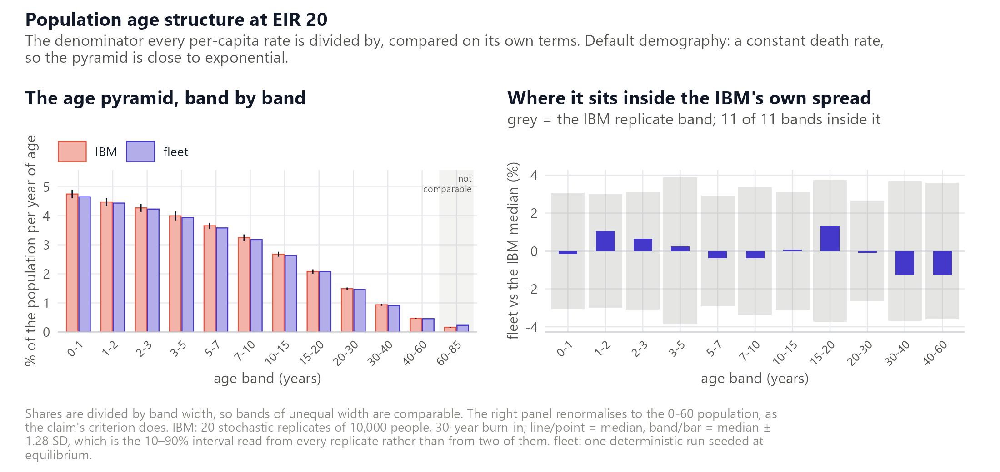

# Validation evidence

How closely does `fleet` reproduce `malariasimulation`? Each claim below
states the criterion that decides it, the value measured against that
criterion, and a verdict. The order runs from transmission through
clinical and severe burden to their age distributions, then
interventions and real settings, with the demographic, performance and
numerical checks that underwrite them at the end.

Every section is generated from `claims.yml`, so this page cannot
disagree with the register, and the register cannot be changed without
the page following.

**11 claims — 0 failing, 0 untested, 0 open, 11 pass.**

| claim | tier | criterion | measured | verdict |
|----|----|----|----|----|
| [`prevalence-eir`](#prevalence-eir) | 2 | inside the IBM replicate band at every EIR on the grid | inside at 6 of 6; largest departure 0.94% of the IBM median | pass |
| [`clinical-allage-eir`](#clinical-allage-eir) | 2 | inside the IBM replicate band at every EIR on the grid | inside at 6 of 6 | pass |
| [`clinical-under5-eir`](#clinical-under5-eir) | 2 | inside the IBM replicate band at every EIR on the grid | inside at 6 of 6 | pass |
| [`severe-allage-eir`](#severe-allage-eir) | 2 | inside the IBM replicate band at every EIR on the grid | inside at 6 of 6 | pass |
| [`age-profile-clinical`](#age-profile-clinical) | 2 | inside the IBM replicate band in every age band carrying at least 5% of clinical episodes, at EIR 3, 20 and 120 | inside at 25 of 25 tested bands across the three EIRs, holding 94% of episodes; largest departure 1.17 replicate SD | pass |
| [`age-profile-severe`](#age-profile-severe) | 2 | inside the IBM replicate band in every age band carrying at least 5% of severe episodes, at EIR 3, 20 and 120 | inside at 16 of 16 tested bands across the three EIRs, holding 94% of episodes; largest departure 0.94 replicate SD, in the 3-5 y band at EIR 20 | pass |
| [`intervention-impact`](#intervention-impact) | 2 | outside the IBM replicate band in no greater a share of cells than the best held-out IBM replicate, over every intervention and outcome at EIR 3, 20 and 120 (SMC in a seasonal setting, since it is a seasonal intervention) | fleet outside in 8.3% of 72 cells, against 9.7% for the closest of the twenty IBM replicates and 20.1% for the median one | pass |
| [`real-settings-correlation`](#real-settings-correlation) | 3 | r \> 0.95 and \|slope - 1\| \< 0.10 on both clinical and severe incidence | clinical r 0.983 slope 0.996; severe r 0.959 slope 0.929, over 450,684 sub-site-months in 1,391 sub-sites of 63 countries | pass |
| [`population-age-structure`](#population-age-structure) | 2 | inside the IBM replicate band in every age band below 60 years, on shares renormalised to the 0-60 population | inside at 11 of 11; largest departure 1.3% of the IBM median | pass |
| [`speed`](#speed) | 2 | at least 10x faster than the IBM on the same scenario set | 21x on cost per simulated year; 19.9 CPU-hours for the IBM against 169 s for fleet | pass |
| [`seed-stability`](#seed-stability) | 1 | PfPR(2-10) departs from its seeded value by less than 1% over 15 years at EIR 20 | 0.28% maximum excursion; flat to 0.02% over the last five years | pass |

## prevalence-eir

pass — LM prevalence in 2-10 year olds tracks the IBM across
transmission intensity.

tier 2 · `validations/02-scenarios`

## clinical-allage-eir

pass — All-age clinical incidence tracks the IBM across transmission
intensity.

tier 2 · `validations/02-scenarios`

## clinical-under5-eir

pass — Under-5 clinical incidence tracks the IBM across transmission
intensity.

tier 2 · `validations/02-scenarios`

fleet sits within 1.3% of the IBM median at every EIR on the grid.

## severe-allage-eir

pass — All-age severe incidence tracks the IBM across transmission
intensity.

tier 2 · `validations/02-scenarios`

fleet sits 2 to 4% below the IBM at every EIR above 1. About -6% of that
is age-grid discretisation, which refining removes; the remainder is not
resolved. Not a bias to correct for. A band test cannot see an offset
repeated at every point. Severe has the widest replicate spread here,
15.4% of the median, which is what sets the twenty-replicate count.

## age-profile-clinical

pass — The age distribution of clinical incidence tracks the IBM.

tier 2 · `validations/02-scenarios`

One untested band is outside: 40-60 y at EIR 20, by 1.50 SD, holding
1.7% of clinical episodes. tables.R prints it rather than dropping it
silently. That band is what the claim used to fail on, and the failure
did not survive examination. Refining the age grid does not close it and
makes agreement worse – 35 of 36 bands inside at the default 53 groups,
32 at 105, 27 at 209 – and the biting-heterogeneity quadrature is not a
candidate, since the IBM discretises it the same way. Re-binned to five
years the departure is smooth from age 20 to 85, sits in the rates
rather than the population weights, and falls inside the spread of a
held-out IBM replicate: 3 of 20 replicates score at least as far from
the other 19. What the burden floor costs: a defect confined to the
oldest ages would not be caught here. Grid convergence is measured in
validations/age-grid/; the held-out check is not yet reproduced by a
script in this repository.

## age-profile-severe

pass — The age distribution of severe incidence tracks the IBM.

tier 2 · `validations/02-scenarios`

The burden floor is doing little here: no untested band is outside the
band either, and the worst departure is in the 3-5 y band, which carries
16.6% of severe episodes on its own. Most of what the floor excludes is
above age 30, where the IBM’s replicate spread reaches 246% of its
median and agreement is not evidence of much.

## intervention-impact

pass — The modelled impact of each intervention matches the IBM.

tier 2 · `validations/02-scenarios`

The bar is taken from the IBM because at 72 cells a fixed one cannot be:
a 1.28 SD band leaves a fifth of cells outside by construction, and no
replicate is inside all 72. fleet is outside less often than any of the
twenty. Where fleet does sit outside, the size is small in both senses.
The worst cell is bed nets at EIR 120 on prevalence, where the IBM cuts
PfPR(2-10) from 0.787 to 0.571 and fleet to 0.587: a 2.1 percentage
point difference in the reduction, 7.6% of the effect. The typical gap
does not grow with transmission – 0.49, 0.35 and 0.42 percentage points
at EIR 3, 20 and 120. Impact is a ratio of two runs sharing an age grid,
so grid discretisation divides out: replacing the grid left the worst
excursion unchanged. Perennial chemoprevention is the one intervention
whose delivery the models cannot share. The IBM doses each child on
reaching a dose age; fleet approximates that as monthly pulses over a
30-day band, which doses 8 to 21 days late and overstates the infant
benefit by about a tenth. The window is the three years after
deployment. Run longer and fleet develops a severe-incidence rebound,
-0.5% at EIR 3 to +8% at EIR 120, which these IBM rows are too short and
too noisy to test.

## real-settings-correlation

pass — Agreement holds across real transmission settings, not just
synthetic scenarios.

tier 3 · `validations/03-real-settings`

r and slope test whether fleet tracks the IBM, not whether it sits on
top of it. No single excess figure describes the level: it runs from
+190% below pf EIR 0.1 to +2.3% above 120, and severe crosses zero at
high transmission. 18% of sub-sites sit below EIR 1, outside any tier-2
claim, and that is where the departure lives. Guinea-Bissau is a
separate failure: 18 sub-sites at +108% and r 0.635, against 553 peers
of the same burden at +11.8% and r 0.991. diagnose.R ranks every
sub-site. Monthly, and P. falciparum only on both arms. Annual means
once hid a real seasonal mismatch; the shipped diagnostics carry vivax
rows that inflate the baseline where pf transmission is low.

## population-age-structure

pass — The population age structure matches the IBM’s.

tier 2 · `validations/02-scenarios`

The 0-60 restriction is a rendering convention, not a model difference:
fleet’s oldest group is absorbing and open-ended above 80, and the
renderer assigns it wholly to the band containing its lower edge, so
fleet’s 60-85 share is 41% higher by construction. Agreement at this
level depends on the ageing rate being exponentially fitted, r =
mu/expm1(mu\*width), exact at the seed and an approximation under
time-varying demography. Separately: maternal immunity is drawn from the
group containing age 20, which is 20-22.5 here against the IBM’s 20-21,
so infants start with about 6.7% too much. Known, not yet fixed.

## speed

pass — fleet is fast enough to be worth using in place of the IBM.

tier 2 · `validations/02-scenarios`

*No figure: this claim is a single number rather than a relationship
across a range, and a chart of one number carries less than the number.*

## seed-stability

pass — An undisturbed run holds the equilibrium it was seeded at.

tier 1 · `validations/01-seed-stability`

The one claim here whose measured value no script in this repository
reproduces: validations/01-seed-stability/ is a stub. The figure comes
from a run made outside it, which is the arrangement the rest of the
register exists to avoid.

*No figure: this claim is a single number rather than a relationship
across a range, and a chart of one number carries less than the number.*

## What “tier” means

What it costs to reproduce a result is a property of that result, so it
is recorded against every claim rather than stated once in prose.

| tier | cost    | who can reproduce it                                     |
|------|---------|----------------------------------------------------------|
| 0    | seconds | anyone, from the committed summaries                     |
| 1    | ~2 min  | anyone; re-runs `fleet` only                             |
| 2    | ~2 h    | anyone with about ten cores                              |
| 3    | ~40 min | about ten cores, and inputs that are not redistributable |

Tier 3 is the 63-country site-file comparison. **Its figures and
statistics are public; the site files behind them are not.** The
constraint is the inputs rather than the compute: the sweep re-runs
`fleet` only, because the IBM arm is the pre-run diagnostic shipped with
each site file, so forty minutes on ten cores refreshes it. But the site
files are not redistributable, so nobody outside the project can repeat
it. That is a limitation of this evidence, not a property of the result,
and `validations/03-real-settings/example-one-site.R` runs the same
pipeline on a single sub-site for anyone who has one site file.
